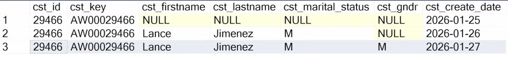

= Silver layer

[sidebar]
{code-loc}/src/silver/[/src/silver/]

The Silver layer serves as the intermediate processing stage in the data pipeline. In this layer, raw data from the Bronze layer is cleaned, transformed, and enriched to enhance its quality and usability for analysis.

The key functions of the Silver layer include:

* Data Cleaning: Removing duplicates, handling missing values, and correcting inconsistencies in the data.
* Data Transformation: Converting data into a more structured format, applying business rules, and aggregating information as needed.
* Data Enrichment: Integrating additional data sources to provide more context and insights.

By implementing these processes in the Silver layer, we ensure that the data is reliable and ready for advanced analytics and reporting in the subsequent Gold layer.

== Data integration analysis and sketch

[plantuml,silver_analysis,png]
----
@startuml

package CRM {
    map crm_sales_details {
        cst_id =>
        prd_key =>
    }
    map crm_cust_info {
        cst_id =>
        cst_key =>
    }
    map crm_prd_inf {
        prd_key =>
    }
    crm_sales_details::cst_id --> crm_cust_info::cst_id
    crm_sales_details::prd_key --> crm_prd_inf::prd_key
}

package ERP {
    map erp_cust_az12 {
        cid =>
    }
    map erp_loc_a101 {
        cid =>
    }
    map erp_px_cat_g1v2 {
        id =>
    }
    erp_cust_az12::cid --> crm_cust_info::cst_key
    erp_loc_a101::cid --> crm_cust_info::cst_key
    erp_px_cat_g1v2::prd_key --> crm_prd_inf::prd_key
}

@enduml
----

== Coding the transformations

Add metadata columns to track data lineage and help with debugging.
We'll add a `created` column to each silver table.
Following the data engineer naming conventions (details in Baraa's video),
and Postgres syntax, we add this column to the create script:

[source,sql]
----
dwh_created     TIMESTAMP DEFAULT CURRENT_TIMESTAMP;
----

=== CRM customer info table

Next, we gotta check the data quality of the bronze tables.

First, we'll check for nulls in the primary key columns.

[source,sql]
----
select cst_id, count(*) from bronze.crm_cust_info
group by cst_id having count(*) > 1 or cst_id is null
----

Reveals some duplicates.

image::media/dupe-keys-0.png[Duplicate keys found]

Focus on one to see what the problem is.

[source,sql]
----
select * from bronze.crm_cust_info
where cst_id = '29466';
----

Results:

This shows that there are multiple entries with different dates.
Since this data warehouse specification doesn't need historical data,
we'll take the latest.

But remember, we leave bronze the same and transform (clean) as we go.
To do this, let's grab the latest record per `cst_id` and rank them.

[source,sql]
----
select *, row_number() over (
	partition by cst_id order by cst_create_date desc
) as flag_last
from bronze.crm_cust_info
where cst_id = 29466;
----

We'll apply this to the whole table to see if this same procedure
flags all duplicates.

[source,sql]
----
select * from (
    select *, row_number() over (
    	partition by cst_id order by cst_create_date desc
    ) as flag_last
    from bronze.crm_cust_info
) sub
where flag_last != 1;
----

Checking against the duplicates found earlier, when we change `flag_last = 1`,
we see that all duplicates are removed.

That's just one example of data cleaning in the silver layer.
See the `src/silver` folder for the full SQL scripts.

In addition to *removing duplicates in primary keys*, we will do things like:

- *Remove unwanted spaces in text fields*
- *Data normalization or standardization*, e.g. consistency of values in low cardinality columns
- *Handling missing values appropriately*, e.g. replacing NULLs with 'Unknown' or default values

=== CRM product info and sales tables

For the `crm_prd_info` table, we will, in addition:

- *Derive new columns*, e.g. extracting category from product codes
- *Data type conversions*, e.g. casting timestamps with `00:00:00` times to date
- *Data enrichment*, e.g. making sales end dates make sense and not overlap with start dates

For the `crm_sales_details` table, the sales, quantity, and price columns are tricky.
After doing some quality checks, we discover quite a few places where things don't add up.
Before doing *data enrichment*, we would verify with the data owner what to do with these
bad values.

The rules Baraa came up with are:

- If sales is negative, zero, null, or not equal to derived sales from quantity * price, set it to derived value
- If price is zero or null, derive it from sales / quantity (or null if 0 quantity to prevent div by 0)
- If prices is negative, set it to absolute value (positive)

=== ERP tables

In addition to deriving a valid foreign key to `crm_cust_info`,
there are birthdays that are in the future and as old as 1917!
After consulting the data owner, we decide to set future birthdays
to null and leaving old birthdays as is.

For the `erp_loc_a101` table, besides deriving the foreign key,
we also normalize the country fields.

For the `erp_px_cat_g1v2` table, we already derived a category id
column in the cust_prod_info silver table that matches the id, and
when checking spaces, standardization, and consistency, we find no issues.